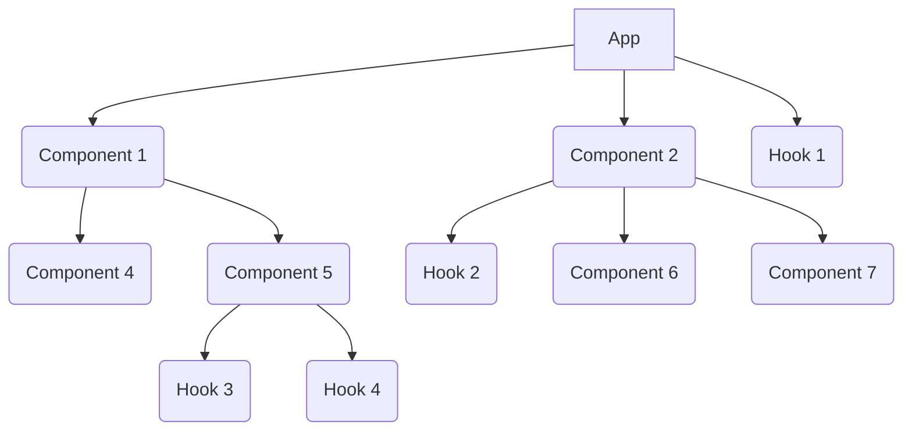
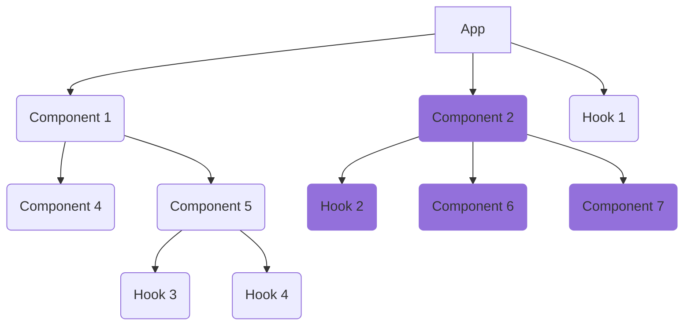

React is a very powerful front end UI rendering library. Although it has a simple rendering principle you can quickly
understand, using it in a large scale application needs more attention to its basic principles. Such attention will
empower you to provide better user experience and enhance your application performance.

<!-- truncate -->

## Reactive Programming

React is built around the idea of [reactive programming](https://en.wikipedia.org/wiki/Reactive_programming) paradigm.
The Application UI is assembled of components which are functions of reactive data.

There is also the concept of hooks which are exactly the same like components but it returns reactive data instead of UI
elements. Hooks are powerful to provide a modularity for the reactive data inside the UI components.

$$
Component = f(data) \space\space\space\space,\space\space\space\space Hook = f(data)
$$

That leads to the main concept of React applications which render the application's UI as a tree of components and
hooks. Each component can receive reactive data from the parent component (props) or self managed inside the component
(state).



## Reactive Functions are Impure

In React, components and hooks are always considered as impure functions. Although they might be a pure functions, it is
safer to consider all as impure to make sure any change of the reactive data will be rendered correctly on the screen.

Lets review the difference between pure and impure functions

### Pure functions

Any function that returns the same result every time you provide the same input parameters.

The results of pure functions can be calculated once and cached to be returned if same inputs presented.

```js
function sum_numbers(num1, num2) {
	return num1 + num2;
}

sum_numbers(1, 1); // always return 2
sum_numbers(2, 2); // always return 4
```

### Impure functions

Any function that can return different values every time it runs with the same input parameters.

That result of impure functions are hard to be cached because it is keep changing with every run.

```js
const counterStore = { currentId: 1 };

function getNewId() {
	const newId = counterStore.currentId++;
	return newId;
}

getNewId(); // return 1
getNewId(); // return 2
```

## React Components Re-Render

In React, whenever a component props or states are changed, the component itself and all components and hooks used
inside that component will be rerendered.

That means the whole components in that tree branch will be considered as impure functions and all of them will be
rerendered although they might be a pure functions.



## What About Children Component as Props?

Children components are rendered in the parent component not inside the child component. So it will be rerendered only
if the parent component rerendered.

In the following example `ContentComponent`, will be rerender if the `ParentComponent` is rerendered, but will not be
affected by `ChildComponent` render.

```jsx
const ParentComponent = () => {
	return (
		<ChildComponent>
			<ContentComponent />
		</ChildComponent>
	);
};
```

## Components Hierarchy And Performance

Now it is the time to consider the hierarchy of components as first step to optimize React application performance.

Lets take the following example

```jsx
const LandingPage = () => {
	const [emailValue, setEmailValue] = useState('');

	<div>
		<LargeProductsList />
		<form>
			<h3>Contact Us</h3>
			<input value="email" onInput={(e) => setEmailValue(e.currentTarget.value)} />
			<button>Submit</button>
		</form>
	</div>;
};
```

In that example whenever the user start typing the email, they will experience some performance lacking.

That is happening with every key press in the input component because React should rerender the `LargeProductsList`
component as well.

You might start thinking about `memo`, `useMemo` or `useCallback`, however that can be fixed by restructure your
components hierarchy only as following:

```jsx
const ContactUsForm = () => {
	const [emailValue, setEmailValue] = useState('');

	return (
		<form>
			<h3>Contact Us</h3>
			<input value="email" onInput={(e) => setEmailValue(e.currentTarget.value)} />
			<button>Submit</button>
		</form>
	);
};

const LandingPage = () => {
	<div>
		<LargeProductsList />
		<ContactUsForm />
	</div>;
};
```

:::note

That example is a basic example but similar cases in a large scale application might not be easy to be recognized, so
always choose the proper components structure in the early development stages

:::

## Summary

Always consider a proper React components structure in the early stages of the development to make sure the
application's performance is already optimized.

React performance utilities such as `memo`, `useMemo` or `useCallback` are very powerful tools however they are not the
first strategy to optimize the performance. They are exist for some edge cases but also they are coming with a cost of a
memory and processing which can make the performance worse if they get overused.
